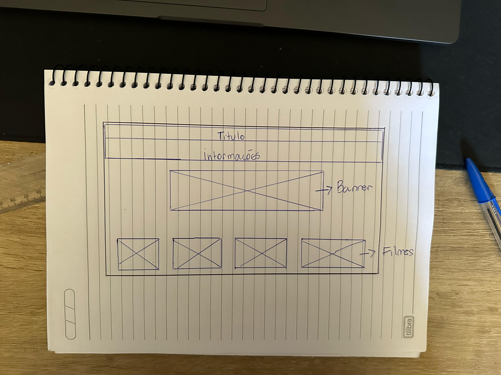
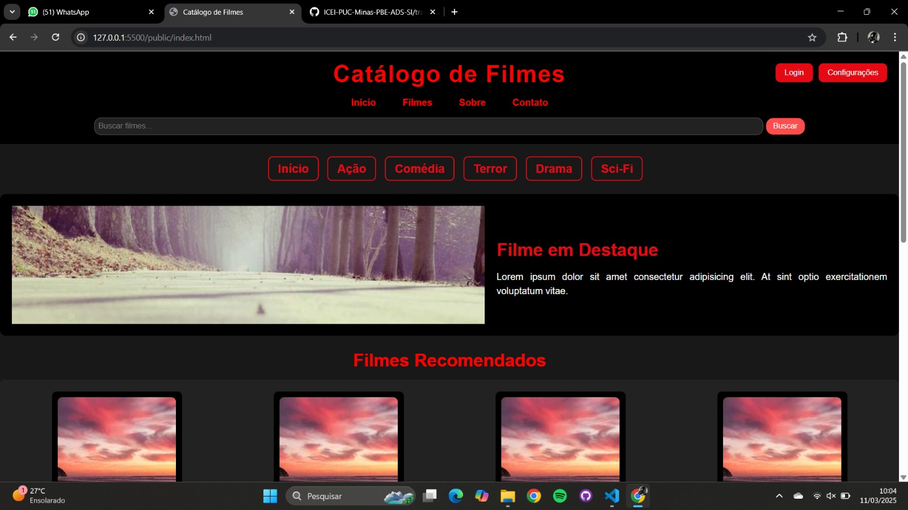
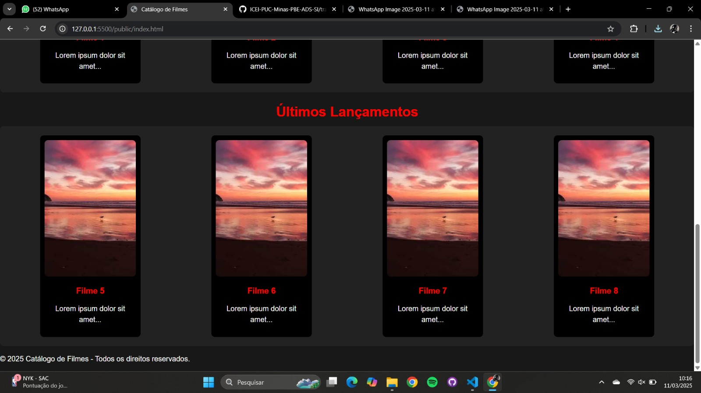

# Trabalho Prático - Semana 03

Dessa vez, vamos escolher uma proposta de projeto para trabalhar. Na [lista de propostas de projetos](propostas-projetos.md), escolha um dentre as alternativas.

Nessa atividade, você deverá montar a página inicial do projeto escolhido, a organização do HTML aplicando semântica correta e uso aprimorado do CSS. Leia o enunciado completo no Canvas para mais detalhes.

**IMPORTANTE:** Você deve trabalhar e alterar apenas arquivos dentro da pasta **`public`**. Deixe todos os demais arquivos e pastas desse repositório inalterados. **PRESTE MUITA ATENÇÃO NISSO.**

## Informações Gerais

- Nome: Daniel Meireles Aquino Jorge
- Matricula: 882875
- Proposta de projeto escolhida: Catalogo de Filmes
- Breve descrição sobre seu projeto: Esse projeto tem como objetivo mostrar como poderia ser a estrutura de um site para organizar e apresentar filmes. A ideia é dividir os filmes por categorias para facilitar a navegação e simular como uma plataforma desse tipo funcionaria na prática.

## Print do esboço criada

## Print da home-page criada

